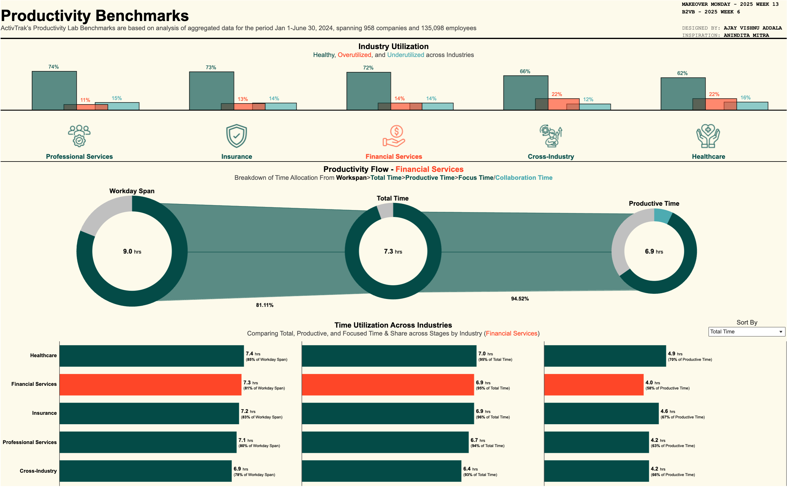

# ActivTrak Productivity Lab: 2024 Benchmarks

### Unlocking Workplace Efficiency and Performance

This repository provides an overview of ActivTrak’s Productivity Lab Benchmarks, a comprehensive analysis of productivity trends across industries. Using aggregated data from January 1 to June 30, 2024, this report highlights key insights derived from 958 companies and 135,098 employees.

---

## Table of Contents

- [Project Overview](#project-overview)
- [Key Visuals](#key-visuals)
  - [Funnel Donut Chart](#funnel-donut-chart)
  - [Industry Bar Charts](#industry-bar-charts)
  - [Utilization Analysis](#utilization-analysis)
- [Snapshot](#snapshot)
- [Interactive Dashboard](#interactive-dashboard)

---

## Project Overview
ActivTrak’s Productivity Lab Benchmarks are designed to help teams:
- Compare their performance to industry standards.
- Identify areas to improve or reinforce.
- Make data-driven decisions to enhance productivity.

The analysis focuses on:
- **Hierarchy of Time Allocation**: Workspan > Total Available Time > Productive Time > Focus & Collaboration Time.
- **Industry Comparisons**: Visuals break down total time, productive time, and focus time by industry.
- **Utilization Trends**: Healthy, underutilized, and overutilized time across industries.

---

## Key Visuals

### Funnel Donut Chart
Illustrates the flow of time allocation through the hierarchy:
- Workspan
- Total Available Time
- Productive Time
- Focus & Collaboration Time

### Industry Bar Charts
Bar charts display industry-specific insights for:
1. **Total Time**: Percentage of Workspan.
2. **Productive Time**: Percentage of Total Time.
3. **Focus Time**: Percentage of Productive Time.

### Utilization Analysis
Highlights the distribution of:
- **% Healthy Time**
- **% Underutilized Time**
- **% Overutilized Time**

---

## Snapshot

*A preview of the Tableau Dashboard visualizing productivity benchmarks.*

---

## Interactive Dashboard
Explore the full dashboard for a deeper dive into the data:

[View the Tableau Dashboard](https://public.tableau.com/shared/3XHQMRBXF?:display_count=n&:origin=viz_share_link)

---

